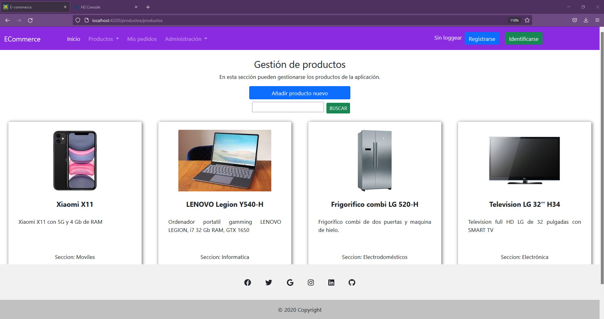
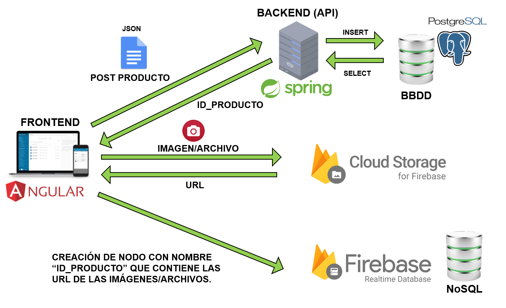
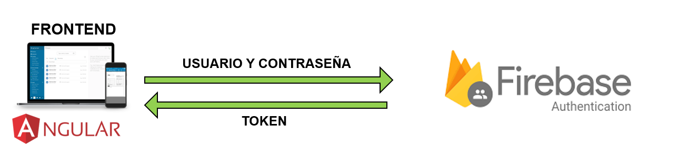
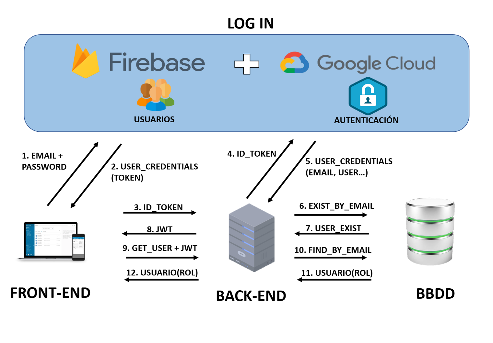
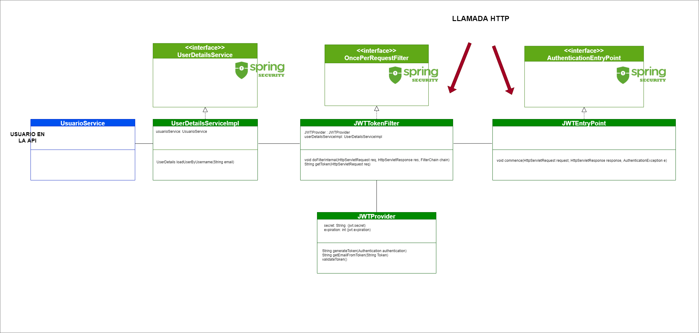
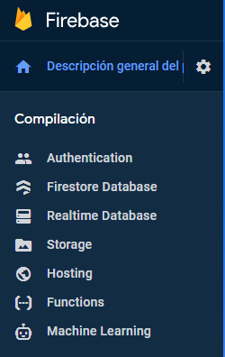
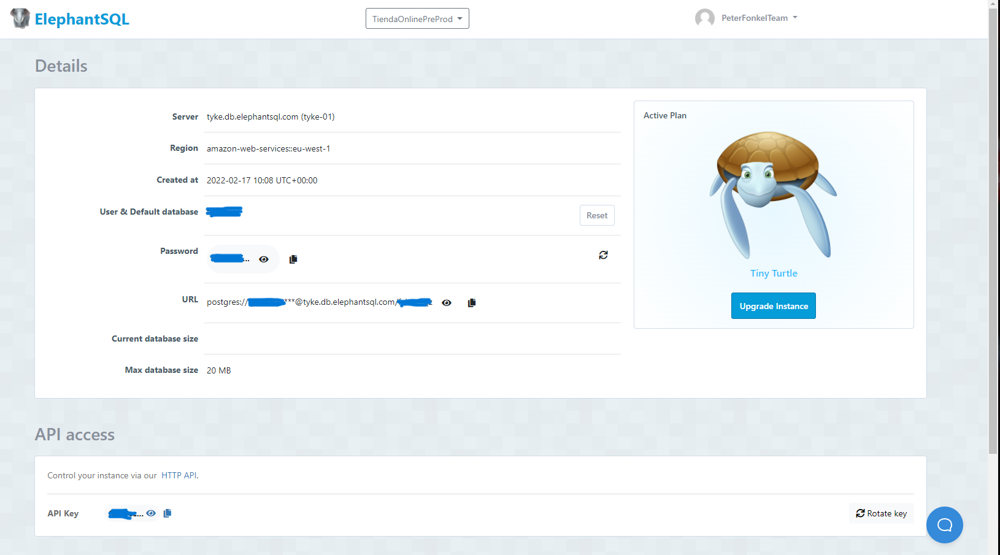
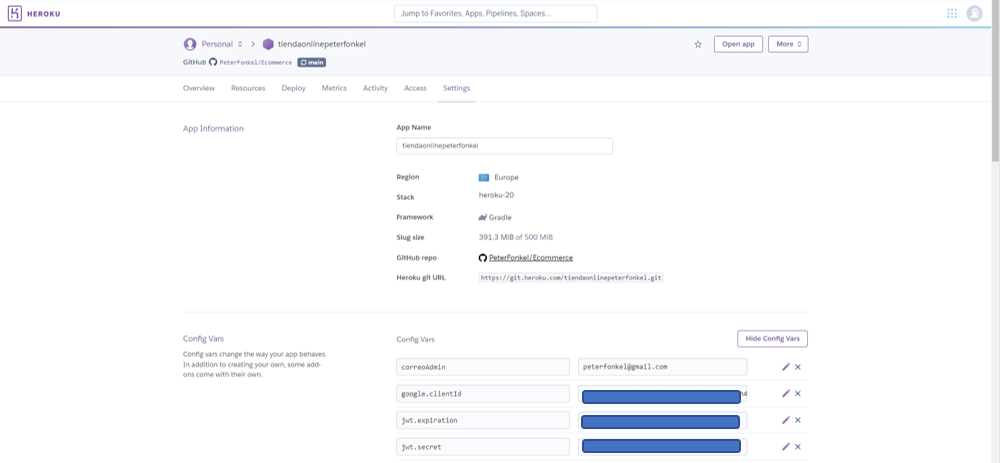
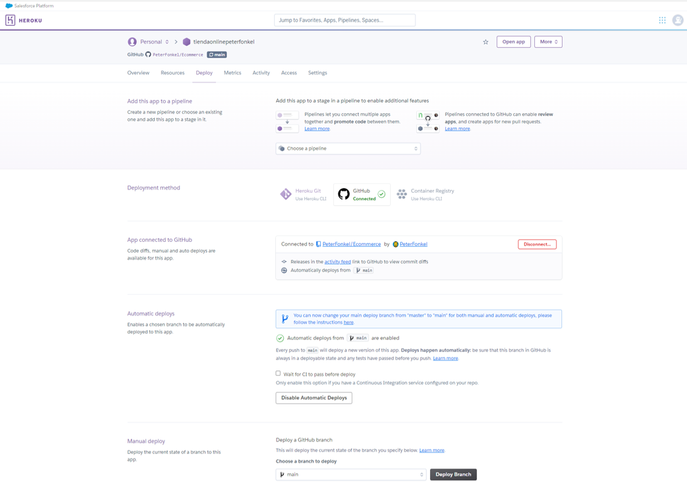
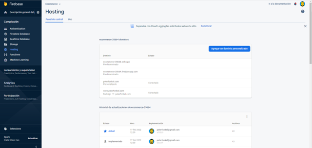

# E-Commerce

## 1. Descripción general

Esta es una aplicación de comercio en internet en la que se pueden encontrar productos agrupados en secciones y en la que se pueden realizar pedidos. 

La aplicación gestiona los permisos con roles (Admin y User) controlando el acceso con Jason Web Token (JWT) y realizando la verificación por usuario y contraseña con Firebase Auth.

Funcionalidades:
- CRUD de productos con datos e imagenes (busqueda por palabras y filtro por sección).
- CRUD de pedidos con productos y gestion de envio y entrega.
- CRUD de usuarios con roles.
- CRUD de secciones.


<p align="center">
  
</p>

## 2. Arquitectura

Este proyecto se compone de una API REST HATEOAS en el Backend, un FrontEnd desarrollado con Angular, una base de datos SQL (H2 en desarrollo y ElephantSQL en pre-producción).
El almacenamiento de imagenes se realiza en FIrebase (Storage y Realtime Database).
<br>
<p align="center"><b>CREACIÓN DE UN PRODUCTO</b></P>
<p align="center">
  
</p>


## 3. Seguridad

La arquitectura de la seguridad es la siguiente:

Login con usuario y contraseña: Firebase (Google Cloud).

Seguridad API: Spring Security y JWT.

Los usuarios se registran solos como "user". El "admin" puede crear también  otros usuarios "admin".

### 3.a. Autenticación con Firebase

Los usuarios y contraseñas son gestionados por Firebase Auth.
 <p align="center">
  
</p>


### 3.b.Seguridad API con Jason Web Token (JWT).

Cuando un usuario se loggea con Firebase, obtiene un token de firebase. Con este token realiza una petición de loggearse en la API. Si el token es válido (comprobación con Google) y se encuentra registrado en la API recibe un JWT. Las sucesivas peticiones a la API se realizan adjuntando este JWT. La API, con este JWT, determina si esta autorizado y que rol tiene (y por tanto a que recursos puede acceder).

 <p align="center">
  
</p>

### 3.c. Implementación seguridad con usuarios y roles con JWT

Descripción del funcionamiento de la gestion de usuarios y roles con Jason Web Token.

 <p align="center">
  
</p>

En build.gradle:

```
dependencies {
  ...
  implementation 'org.springframework.boot:spring-boot-starter-security:2.5.5'	
  implementation 'io.jsonwebtoken:jjwt:0.9.1'
  
  testImplementation 'org.springframework.security:spring-security-test'
  ...
  }
``` 

##### Paquete JWT

- JWTEntryPoint

Clase que impleneta AuthenticationEntryPoint de Spring Security y que se encarga de lanzar una excepción cuando la llamada HTTP recibida no contiene en su cabecera un token. Es un primer filtro de formato de llamada con token.

- JWTProvider

Clase que gestiona las operaciones internas con los token. Creación de un token, extraer un email de un token o verificar un token.

- JWTFilter

Clase que gestiona las llamadas HTTP recibidas comprobando si contienen un token válido. Contiene un método "doFilterInternal" qie se ejecuta con cualquier llamada HTTP. Extrae el token y lo comprueba con la clase JWTProvider. Si es válido crea un "SecurityContext" del usuario autenticado. 


##### OauthController

Es el unico punto de acceso que no está securizado. Este controlador recibe una llamada para autenticarse con un token de Firebase, lo verifica con Google y devuelve un JWT creado por JWTProvider. Este token se adjuntará a las sucesivas llamadas HTTP del Front.

##### UserDetailsServiceImpl

Clase que implementa la interfaz "UserDetailsService" y que tiene un método que devuelve un Usuario del tipo UserDetails. Es el tipo empleado para la gestión de permisos en Spring Security.

##### Paquete config

Configuración de la seguridad.

- MyWebSecurity

Clase de configuración de la seguridad. Se definen parametros como:
1. End-points sin securizar: En nuestro caso "oauth", "usuarios/search", "roles" y "secciones/search".
2.  Punto de entrada: JWTEntryPoint.
3.  Filtro: JWTTokenFilter


## 4. Instrucciones de instalación

### 4.a. Crear Proyecto en Firebase

1. Accedemos a la consola de Firebase con nuestro email de google: [Consola_Firebase](https://console.firebase.google.com/).
2. Agregamos un proyecto.
3. Click en "Authentication" en el menu lateral.
4. Click en Comenzar.
5. Crea un usuario con el correo "admin" y su contraseña.
6. Click en "Realtime Database" en el menu lateral.
7. Click en Comenzar.
8. Configuramos las reglas de seguridad:
~~~
"rules": {
    ".read": "auth.uid != null ",
    ".write": "auth.uid == 'ID_DEL_ADMIN'"
  }
}
~~~

9. Click en "Storage" en el menu lateral.
10. Click en Comenzar.
11. Configuramos reglas de seguridad:
~~~
rules_version = '2';
service firebase.storage {
  match /b/{bucket}/o {
    match /{allPaths=**} {
      allow write: if request.auth.uid == 'ID_DEL_ADMIN';
      allow read: if request.auth != null;
    }
  }
}
~~~
12. En "Agrega tu primer método de acceso y comienza a utilizar Firebase Auth" agregamos "Correo electrónico/contraseña" (lo habilitamos).
13. Volvemos a la pagina principal del proyecto (click en "Descripción general del proyecto") y agregamos Firebase a nuestra app (click en simbolo WEB).
14. Nombramos nuestra app y click en "Registrar".
15. Creamos un proyecto en Google Cloud. [Google CLoud](https://console.cloud.google.com/)
16. En el menu lateral "API y Servicios" > Credenciales > +CREAR CREDENCIALES > Id de cliente OAuth. Copiamos el id, lo necesitaremos en el "claves.properties" que crearemos mas adelante.


### 4.b. Instalación de firebase

#### En el Front:

En la consola de nuestro ordenador y en la carpeta de nuestro proyecto:

`npm install firebase --save`

Cambiamos la versión de Firebase en package.json: 

```
"dependencies": {
   
    "firebase": "^8.10.0"
    
  }
  ```
  
  Reinstalamos las dependencias:
  
  `npm install`
  
  En la carpeta enviroments creamos el archivo firebase.ts con la configuración de nuestro proyecto Firebase. Esta información se encuentra en el icono ⚙️ al lado de "Descripción general del proyecto" > "configuración del proyecto".
  
  
 <p align="center">
  
</p>
  
  
  ```
  export const firebaseConfig = {
  
    apiKey: "XXXXXXXXXXXXXXXXXXXX",
    authDomain: "xxxxxxxxxxxxx.firebaseapp.com",
    projectId: "xxxxxxxxxxxxxxxxx",
    messagingSenderId: "xxxxxxxxxx",
    appId: "xxxxxxxxxxxxxxxxxxxxxxxxxxxxx",
    measurementId: "xxxxxxxxxxxxxxxx"
    
 };
 ```

Estas claves son privadas. Añadir a gitignore antes de subir a github.

#### En la API:

En build.gradle:

```
dependencies {
  ...
  implementation 'com.google.firebase:firebase-admin:8.1.0'
  implementation 'com.google.api-client:google-api-client:1.30.9' 
  ...
  }
``` 
Creamos un archivo claves.properties en la carpeta resources de la API.
~~~
# Autenticacion con googleID debe coincidir con el del Front
google.clientId="id de cliente OAUTH de google cloud"

# jwt
jwt.secret=kajshdfklhasietewrtyeretert (codigo propio de al menos 20 caracteres)
jwt.expiration=3600000  (tiempo de expiracion del JWT)

# secretPsw
secretPsw=kasdjhfkfvkmdreyetryeyuHAwhjesdF (codigo propio de al menos 20 caracteres)

# correo de administracion
correoAdmin= "email del administrador"
~~~
IMPORTANTE: Añadir a gitignore antes de subir a GITHUB. Sino expondrás tus claves.


### 4.c. Base de datos H2 (local)

Enlace de descarga y guia de instalación de la base de datos H2 local para desarrollo. [H2 Database Engine](https://www.h2database.com/html/main.html)

En aplication.properties:

~~~
# Configuracion de acceso a BD Local
spring.datasource.driver-class-name=org.h2.Driver
spring.datasource.username=sa
spring.datasource.password=

# Tengo que poner la ruta a la BD - en este caso a localhost
spring.datasource.url=jdbc:h2:tcp://localhost/~/Desktop/EcommerceApp/BaseDeDatosH2/test
~~~

No importa que el password de la base de datos este en el aplication.properties y que lo subamos a github. Es simlemente una base de datos local para desarrollo.

### 4.d. Base de datos ElephantSQL (pre-producción)

Enlace de la base de datos Elephant SQL. [ElephantSQL Database](https://www.elephantsql.com/)

Creamos una instancia de la BD:

<p align="center">
  
</p>

Configuramos el acceso a la BD en nuestra API. El password no puede estar en aplication.properties porque se expondrá en github.


En Details vemos los datos de configuracion (URL, usuario y password). Los introducimos en application.properties y en clavers.properties:


En aplication.properties:

~~~
# Configuracion de acceso a BD Elephant
spring.datasource.driver-class-name=org.postgresql.Driver
spring.datasource.username=usuario
spring.datasource.password=contrase�a

# Tengo que poner la ruta a la BD - en este caso a elephant
spring.datasource.url=jdbc:postgresql://<URL>

# Configuracion de Hibernate para elephant
hibernate.dialect=org.hibernate.dialect.PostgreSQLDialect

 # Configuracion para autenticacion en archivo externo
spring.config.import=classpath:claves.properties
~~~

En claves.properties:
~~~
# Configuracion de acceso a BD Elephant
spring.datasource.username=<User & Default database>
spring.datasource.password=<Password>
~~~

## 5. Despliegue

### 5.a. Despliegue del Back en Heroku

Heroku es una plataforma como servicio de computación en la Nube que soporta distintos lenguajes de programación.
En esta plataforma se puede desplegar una API de forma gratuita. Las unicas limitaciones son 500 Mb de peso y que si pasa un tiempo sin recibir llamadas se desactiva. Esto provoca que, cuando se produzca una llamada por primera vez otra vez, tardará en responder unos 15-20 segundos.
Ofrece una versión de pago que no tiene estas limitaciones.

[HEROKU](www.heroku.com)

Creamos una app:

New -> Create new App ->  Create App

Configuramos las variables del entorno (variables que no podemos subir a GITHUB)

Settings - > Reveal config vars

<p align="center">
  
</p>

Creamos las variables del claves.properties que no subimos a github.

Desplegamos la aplicación:

Deploy -> Deploy method -> Github -> Seleccionamos nuestro repositorio en GITHUB.

Activamos automatic deploys. Esto desplegará de nuevo la api cada vez que realicemos un push a la rama seleccionada.

Click en "Deploy Branch". Nos indicará en que url se ha desplegado nuestra API. También podemos consultarla en Deploy / Domains.

Esta url hay que introducirla en el "enviroment.prod" del Front para que el front sepa la direccion de la api en producción.

<p align="center">
  
</p>


### 5.b. Despliegue del Front en Firebase Hosting

En la raiz del proyecto FrontEnd:
~~~
ng build --prod
~~~
Esto creara un directorio dist que contendrá un directorio con el nombre del proyecto compilado con las variables del "enviroment.prod".


Instalacion de firebase-tools:
~~~ 
npm install -g firebase-tool
~~~

Login en Firebase:
~~~
firebase login

? Allow Firebase to collect CLI usage and error reporting information? (Y/n) Y
~~~

En el navegador se abrira una pagina de login con la cuenta de google.

~~~
firebase init

? Which Firebase features do you want to set up for this directory? Press Space to select features, then Enter to confirm your choices. Hosting: Configure files for Firebase Hosting and (optionally) set up GitHub Action deploys, Hosting: Set up GitHub Action deploys

? Please select an option: Use an existing project

? Select a default Firebase project for this directory: ecommerce-35664 (Ecommerce)

? What do you want to use as your public directory? (public)  Enter

? Configure as a single-page app (rewrite all urls to /index.html)? (y/N) N

? Set up automatic builds and deploys with GitHub? (y/N) N

 File public/index.html already exists. Overwrite? (y/N) N
~~~

Borramos el contenido de la carpeta public.
Copiamos el contenido de la carpeta "dist/<nombre_aplicacion>" en la carpeta "public". 

Desplegamos la aplicación:

En la raiz del proyecto Angular:
~~~
firebase deploy 
~~~

El front se desplegará y nos indicará su URL.

En la consola de Firebase podemos configurar un dominio personalizado si lo tenemos.

<p align="center">
  
</p>